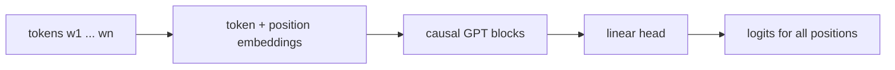

<!-- prettier-ignore-start -->

## Language Models

- Languages are discrete-valued sequences: $$\text{"I am an expert on generative models."}$$

  $$W = [w_1, w_2, \ldots, w_L], ~~~~~~~~ w_i \in \mathcal V,$$ where $\mathcal V$ is the vocabulary of all possible words (or tokens).
  - Discrete valued
  - Variable length
  - Sequential in nature
  - How to build generative models for such data?

## Auto-regressive Language Models

- It is natural to expand the probability using chain rule: $$\begin{aligned}
  p(w_1, w_2, \ldots, w_L)
  & = p(w_1 ) p(w_2 ~|~ w_1) \cdots p(w_L~|~w_1, \ldots, w_{L-1})  \\
  & = \prod_{i} p(w_i ~|~ w_{<i}).
  \end{aligned}$$

$$\text{p("how are you?") = p("how") $\times$ p("are" $\mid$ "how")  $\times$ p("you" $\mid$ "how are") $\times \cdots$}$$

- This allows for
  - Maximum likelihood estimation during training
    - Maximizing the log likelihood of the training data

    $$\max_{\theta}\mathbb{E}_{\text{data}}[\sum_{i=1}^L \log p_\theta (w_i \mid w_{<i})].$$

  - Next token prediction during inference
    

  - Universal question answering: $\text{"What is the secret of life? \_\_\_\_\_\_\_\_\_\_\_\_"}$

## Neural Parameterization of Auto-regressive Models

- Chain rule: $$\begin{aligned}
  p(w_1, w_2, \ldots, w_L)  & = \prod_{i} p(w_i ~|~ w_{<i}).
  \end{aligned}$$
- All $p(w_i ~|~w_{<i})$ are modeled with a neural network with a softmax head:

$$p_\theta(w_i = k ~|~ w_{<i}) = \frac{\exp(h_k^\theta(w_{<i}))}{\sum_{\ell \in \mathcal V} \exp(h_\ell^\theta(w_{<i}))}$$

where $h^\theta = [h_k^\theta]_{k\in \mathcal V}$ is a neural network mapping $w_{\leq i}$ to $\mathbb{R}^{|\mathcal V|}$.

$$
\mathtt{Sequence}
~~ \overset{h^\theta}{\longrightarrow}
~~
\text{logits on } \mathbb{R}^{|\mathcal V|}
~~
\overset{softmax}{\longrightarrow}
~~
\text{probability on } \mathcal V
$$

$$
\begin{aligned}
\underbrace{\text{"I like"}}_{\text{input:}~w_{\leq i}} ~~~~
\overset{h^\theta}{\longrightarrow}
~~~~
\underbrace{\begin{bmatrix}
\text{cat}: 20 \\
\text{math}: 15 \\
\text{broccoli}: -10 \\
\vdots
\end{bmatrix}}_{\text{logits}}
\overset{softmax}{\longrightarrow}
\underbrace{\begin{bmatrix}
\text{cat}: 0.2 \\
\text{math}: 0.15 \\
\text{broccoli}: 0.01 \\
\vdots
\end{bmatrix}}_{\text{probability}}
\end{aligned}
$$

## Generative Pre-trained Transformers (GPT)

- $h^\theta$: Taken to be a transformer with causal masks.

$$
\begin{aligned}
logits_i = LinearHead(\underbrace{GPTBlock(\cdots GPTBlock}_{\text{$N$ layers}}(\text{Embedding}(w_{\leq i}) ))).
\end{aligned}
$$

- Key: All logits in a sentence can be calculated in parallel during training.

<!-- prettier-ignore-end -->
