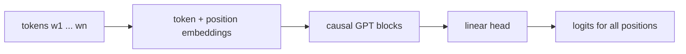

<!-- prettier-ignore-start -->

## Language Models

- Languages are discrete-valued sequences: $$\text{"I am an expert on generative models."}$$

  $$W = [w_1, w_2, \ldots, w_L], ~~~~~~~~ w_i \in \mathcal V,$$ where $\mathcal V$ is the vocabulary of all possible words (or tokens).
  - Discrete valued
  - Variable length
  - Sequential in nature
  - How to build generative models for such data?

## Auto-regressive Language Models

- It is natural to expand the probability using chain rule: $$\begin{aligned}
  p(w_1, w_2, \ldots, w_L)
  & = p(w_1 ) p(w_2 ~|~ w_1) \cdots p(w_L~|~w_1, \ldots, w_{L-1})  \\
  & = \prod_{i} p(w_i ~|~ w_{<i}).
  \end{aligned}$$

$$\text{p("how are you?") = p("how") $\times$ p("are" $\mid$ "how")  $\times$ p("you" $\mid$ "how are") $\times \cdots$}$$

- This allows for
  - Maximum likelihood estimation during training
    - Maximizing the log likelihood of the training data

    $$\max_{\theta}\mathbb{E}_{\text{data}}[\sum_{i=1}^L \log p_\theta (w_i \mid w_{<i})].$$

  - Next token prediction during inference
    

  - Universal question answering: $\text{"What is the secret of life? \_\_\_\_\_\_\_\_\_\_\_\_"}$

## Neural Parameterization of Auto-regressive Models

- Chain rule: $$\begin{aligned}
  p(w_1, w_2, \ldots, w_L)  & = \prod_{i} p(w_i ~|~ w_{<i}).
  \end{aligned}$$
- All $p(w_i ~|~w_{<i})$ are modeled with a neural network with a softmax head:

$$p_\theta(w_i = k ~|~ w_{<i}) = \frac{\exp(h_k^\theta(w_{<i}))}{\sum_{\ell \in \mathcal V} \exp(h_\ell^\theta(w_{<i}))}$$

where $h^\theta = [h_k^\theta]_{k\in \mathcal V}$ is a neural network mapping $w_{\leq i}$ to $\mathbb{R}^{|\mathcal V|}$.

$$
\mathtt{Sequence}
~~ \overset{h^\theta}{\longrightarrow}
~~
\text{logits on } \mathbb{R}^{|\mathcal V|}
~~
\overset{softmax}{\longrightarrow}
~~
\text{probability on } \mathcal V
$$

$$
\begin{aligned}
\underbrace{\text{"I like"}}_{\text{input:}~w_{\leq i}} ~~~~
\overset{h^\theta}{\longrightarrow}
~~~~
\underbrace{\begin{bmatrix}
\text{cat}: 20 \\
\text{math}: 15 \\
\text{broccoli}: -10 \\
\vdots
\end{bmatrix}}_{\text{logits}}
\overset{softmax}{\longrightarrow}
\underbrace{\begin{bmatrix}
\text{cat}: 0.2 \\
\text{math}: 0.15 \\
\text{broccoli}: 0.01 \\
\vdots
\end{bmatrix}}_{\text{probability}}
\end{aligned}
$$

## Generative Pre-trained Transformers (GPT)

- $h^\theta$: Taken to be a transformer with causal masks.

$$
\begin{aligned}
logits_i = LinearHead(\underbrace{GPTBlock(\cdots GPTBlock}_{\text{$N$ layers}}(\text{Embedding}(w_{\leq i}) ))).
\end{aligned}
$$

- Key: All logits in a sentence can be calculated in parallel during training.

## Transformer-Based Language Models

Language models apply self-attention to sequences of tokens. Consider the sentence $$\text{``The cat sat on the mat.''}$$ We index tokens as $(1,\text{``The''}), (2,\text{``cat''}), (3,\text{``sat''}), \ldots$ and map both words and positions into vectors in $\mathbb{R}^d$. Inputs are typically formed by a sum of embeddings: $$x_i \;=\; \text{embedding}(\text{position}_i) \;+\; \text{embedding}(\text{word}_i).$$ The resulting sequence $\{x_i\}_{i=1}^L$ is processed by alternating layers of self-attention and position-wise MLPs: $$y \;=\; \text{MLP}\!\big(\text{SelfAttention}(\cdots \text{MLP}(\text{SelfAttention}(\{x_i\})))\big).$$ Position embeddings supply order information that self-attention alone does not encode. In autoregressive models, a causal mask guarantees that token $i$ only attends to positions $\le i$, aligning the computation with left-to-right generation.

## More Details on Transformer-Based LMs

- **Token-wise MLPs.** The MLP layers act independently on each token's hidden state (shared parameters across positions), providing nonlinear mixing of channel dimensions complementary to the cross-token mixing of attention.

- **Residual connections.** Additive shortcuts are used throughout the stack to preserve gradient flow and allow layers to learn residual refinements of the representation.

- **Layer normalization.** Normalization stabilizes optimization by reducing covariate shift within layers: $$\text{LayerNorm}(x) = a \cdot \frac{x - \text{mean}(x)}{\text{std}(x)} + b,$$ with trainable scale $a$ and bias $b$. It is applied at fixed points of the block (before/after sublayers) to keep activations in a favorable range.

- **Positional encodings.** A common choice is sinusoidal position embeddings, $$\text{embedding}(pos)
          \;=\; \big[(\cos(\omega_k\, pos),\, \sin(\omega_k\, pos))\big]_{k=1}^{d_{\text{embd}}},$$ which provide a deterministic, smooth encoding of order and relative offsets. (Other encodings are possible; here we focus on the sinusoidal case for clarity.)

- **Input composition.** Inputs are typically the sum of word and position embeddings rather than their concatenation, keeping the model width fixed while allowing both content and order information to coexist in each token vector.

- **Causal masking.** In autoregressive LMs (e.g., GPT-style), a strictly triangular attention mask enforces that token $i$ cannot attend to positions $> i$, ensuring the factorization needed for left-to-right likelihood and generation.

Overall, the attention mechanism provides content-adaptive aggregation; multi-head attention diversifies this aggregation across subspaces; self-attention enables all-to-all interaction within a layer; and positional information plus masking specialize the same machinery to the sequential constraints of language modeling. Together with residual connections, layer normalization, and token-wise MLPs, these components form the core computational pattern of Transformer-based LMs.

<!-- prettier-ignore-end -->
